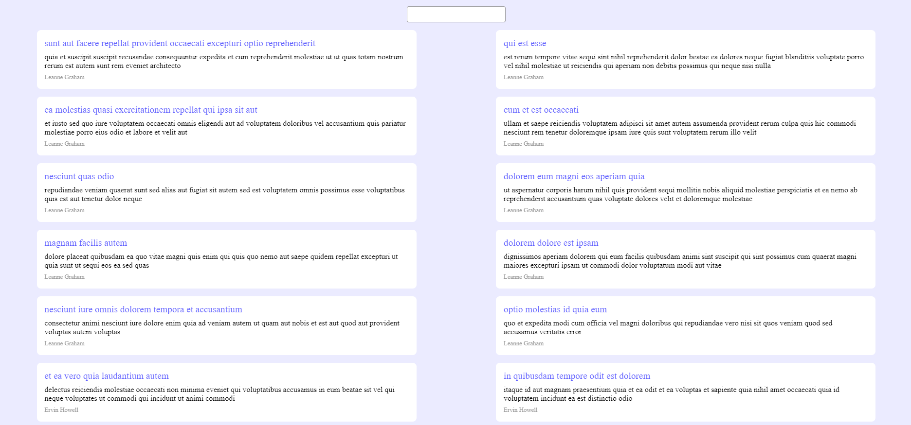
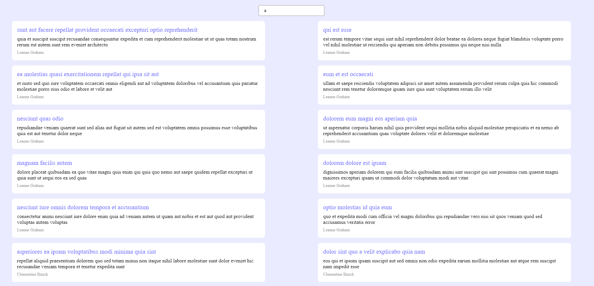
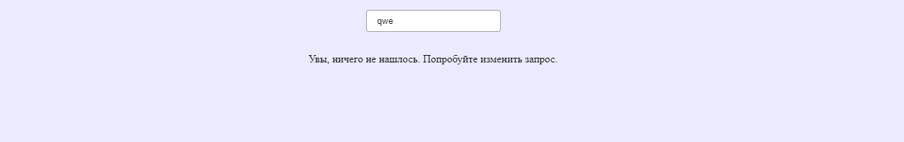
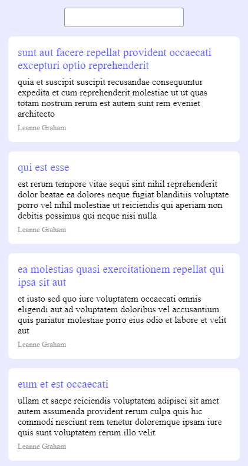
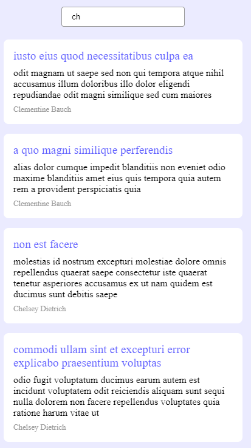
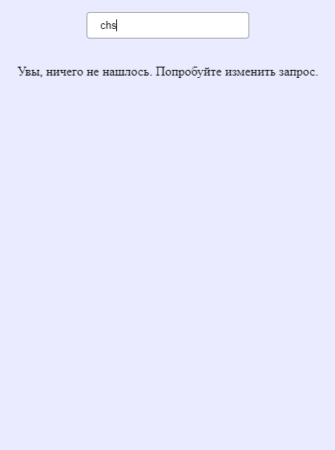

# Nuxt 3 Minimal Starter

Look at the [Nuxt 3 documentation](https://nuxt.com/docs/getting-started/introduction) to learn more.

## Setup

Make sure to install the dependencies:

```bash
# npm
npm install
```

## Development Server

Start the development server on `http://localhost:3000`:

```bash
# npm
npm run dev
```

## Production

Build the application for production:

```bash
# npm
npm run build
```

Locally preview production build:

```bash
# npm
npm run preview
```

Check out the [deployment documentation](https://nuxt.com/docs/getting-started/deployment) for more information.

Макета нет.

Использовала sass-loader.

# Скриншоты








